<div align="center">
  
</div>

<div align="center">
  
</div>

<div align="center">
  
  
  
</div>

---

## 🚀 Giới thiệu về tôi

<table>
<tr>
<td width="55%">

### 👨‍💻 Tôi là ai?
- 🌟 **Tên:** Nam Long
- 📍 **Địa điểm:** Việt Nam 🇻🇳
- 💼 **Vai trò:** Lập trình viên Full Stack
- 🎯 **Tập trung:** Tạo ra những ứng dụng web đẹp và hữu ích
- ☕ **Nhiên liệu:** Cà phê và đam mê lập trình
- 🌱 **Hiện tại:** Đang thành thạo nghệ thuật phát triển web

### 🎨 Những gì tôi yêu thích
- ✨ Xây dựng website responsive từ đầu
- 🔧 Tạo RESTful API với Node.js
- 📊 Thiết kế cấu trúc cơ sở dữ liệu hiệu quả
- 🎯 Giải quyết vấn đề phức tạp bằng giải pháp đơn giản
- 📚 Học hỏi công nghệ mới và best practices

### 💡 Triết lý phát triển của tôi
- 🎨 **Thiết kế:** Trải nghiệm người dùng là ưu tiên hàng đầu
- 🔧 **Code:** Sạch sẽ, dễ đọc và dễ bảo trì
- 🚀 **Hiệu suất:** Ứng dụng nhanh và được tối ưu hóa
- 📱 **Responsive:** Hoạt động hoàn hảo trên mọi thiết bị
- 🔄 **Học hỏi:** Không bao giờ ngừng cải thiện và phát triển

</td>
<td width="45%">

<div align="center">
  
</div>

<div align="center" style="margin-top: 20px;">
  
</div>

</td>
</tr>
</table>

---

## 🛠️ Công nghệ & Công cụ

<div align="center">

### 🎨 Phát triển Frontend
<p>
  
</p>
<p>
  
  
  
</p>

### ⚙️ Phát triển Backend
<p>
  
</p>
<p>
  
  
</p>

### 🗄️ Cơ sở dữ liệu
<p>
  
</p>
<p>
  
</p>

### 🔧 Công cụ phát triển
<p>
  
</p>
<p>
  
  
  
</p>

</div>

---

## 📊 Thống kê GitHub

<div align="center">
  
  
</div>

<div align="center">
  
</div>

---

## 🏆 Thành tích & Cúp

<div align="center">
  
</div>

---

## 💼 Những gì tôi đang làm

<div align="center">

<table>
<tr>
<td width="50%">


</td>
<td width="50%">

### 🎯 Tập trung hiện tại
- 🌐 Xây dựng ứng dụng web full-stack
- 📱 Tạo giao diện người dùng responsive
- 🔗 Phát triển RESTful API
- 🗄️ Thiết kế và tối ưu hóa cơ sở dữ liệu
- 📚 Học các pattern Node.js nâng cao

### 🚀 Mục tiêu tiếp theo
- ⚡ Kỹ thuật tối ưu hóa hiệu suất
- 🔐 Xác thực và best practices bảo mật
- 🧪 Phương pháp testing
- 📦 Quản lý package và deployment
- 🌟 Đóng góp cho các dự án mã nguồn mở

</td>
</tr>
</table>

</div>

---

## 📈 Hoạt động phát triển

<div align="center">
  
</div>

---

## 🎨 Trực quan hóa kỹ năng

<div align="center">

<table>
<tr>
<td width="50%">

```text
HTML/CSS     ████████████████████░   95%
JavaScript   ██████████████████░░░   85%
Node.js      ████████████████░░░░░   75%
MySQL        ███████████████░░░░░░   70%
Git          ████████████████████░   90%
```

</td>
<td width="50%">


</td>
</tr>
</table>

</div>

---

## 🌟 Showcase dự án nổi bật

<div align="center">

| 🚀 Dự án | 💻 Công nghệ | 🔗 Liên kết | ⭐ Trạng thái |
|----------|--------------|-------------|---------------|
| **Website Portfolio** | HTML, CSS, JavaScript | [Demo](#) \| [Code](https://github.com/namlomg) | ✅ Hoàn thành |
| **API Quản lý Task** | Node.js, Express, MySQL | [Demo](#) \| [Code](https://github.com/namlomg) | 🚧 Đang phát triển |
| **Website Thương mại điện tử** | Full Stack | [Demo](#) \| [Code](https://github.com/namlomg) | 📋 Đang lên kế hoạch |
| **Nền tảng Blog** | Node.js, MySQL | [Demo](#) \| [Code](https://github.com/namlomg) | 💡 Ý tưởng |

</div>

---

## 💡 Quote ngẫu nhiên cho Dev

<div align="center">
  
</div>

---

## 🤝 Kết nối với tôi!

<div align="center">

<table>
<tr>
<td width="50%">


</td>
<td width="50%">

### 📬 Liên hệ
<p>
  <a href="mailto:vunamlong3522@gmail.com">
    
  </a>
</p>
<p>
  <a href="https://github.com/namlomg">
    
  </a>
</p>
<p>
  <a href="https://linkedin.com/in/namlong">
    
  </a>
</p>


</td>
</tr>
</table>

</div>

---

## 🎯 Sự thật thú vị về tôi

<div align="center">

<table>
<tr>
<td width="50%">

| 🌟 Sự thật | 📝 Chi tiết |
|------------|-------------|
| 🕐 **Thời gian code tốt nhất** | Đêm khuya với cà phê ☕ |
| 🎵 **Playlist khi code** | Lo-fi hip hop & nhạc không lời |
| 🐛 **Phong cách debug** | console.log() ở khắp mọi nơi! |
| 📚 **Phương pháp học** | Xây dựng dự án trong khi học |
| 🎯 **Mục tiêu 2025** | Thành thạo phát triển full-stack |

</td>
<td width="50%">


</td>
</tr>
</table>

</div>

---

## 🐍 Rắn ăn Contribution

<div align="center">
  
</div>

---

## 📊 Phân tích thời gian phát triển hàng tuần

<div align="center">

<table>
<tr>
<td width="50%">

<!--START_SECTION:waka-->
```text
JavaScript   8 giờ 15 phút   ████████████░░░░░░░░░░░░░   48.2%
HTML         4 giờ 30 phút   ██████░░░░░░░░░░░░░░░░░░░   26.3%
CSS          2 giờ 45 phút   ████░░░░░░░░░░░░░░░░░░░░░   16.1%
Node.js      1 giờ 35 phút   ██░░░░░░░░░░░░░░░░░░░░░░░    9.4%
```
<!--END_SECTION:waka-->

</td>
<td width="50%">


</td>
</tr>
</table>

</div>

---


---

## 🌈 Thêm về hành trình của tôi

<div align="center">

<table>
<tr>
<td width="33%">

### 🎯 Sứ mệnh của tôi


**Tạo ra những trải nghiệm số có ý nghĩa**
- Xây dựng ứng dụng thân thiện với người dùng
- Viết code sạch, dễ bảo trì
- Giải quyết các vấn đề thực tế
- Học hỏi và phát triển liên tục

</td>
<td width="33%">

### 🚀 Tầm nhìn của tôi


**Trở thành chuyên gia full-stack**
- Thành thạo công nghệ web hiện đại
- Đóng góp cho mã nguồn mở
- Xây dựng các dự án có tác động
- Giúp đỡ người khác học lập trình

</td>
<td width="33%">

### 💡 Giá trị của tôi


**Chất lượng hơn số lượng**
- Nguyên tắc code sạch
- Thiết kế lấy người dùng làm trung tâm
- Phát triển cộng tác
- Tư duy học hỏi suốt đời

</td>
</tr>
</table>

</div>

---

## 🎨 chill

<div align="center">


### 🎵 nhạc
<div align="center">
  
  <br>
  
  <p><em>🎧 Lo-fi beats để lập trình chill chill 🎶</em></p>
</div>
```

</div>

---


---


---

## 📱 Giao diện thân thiện với mobile

<div align="center">

*README này được tối ưu hóa cho cả desktop và mobile!*


</div>

---


---

## 🎊 Lời cảm ơn đặc biệt

<div align="center">

### 🙏 Ghi nhận
*Cảm ơn đặc biệt đến cộng đồng mã nguồn mở tuyệt vời và tất cả các developer đã truyền cảm hứng cho tôi mỗi ngày!*


### 🌟 Được truyền cảm hứng bởi
- Cộng đồng GitHub tuyệt vời
- Những người đóng góp mã nguồn mở
- Các developer đồng nghiệp chia sẻ kiến thức
- Tất cả những ai tin vào việc học hỏi liên tục

</div>

---

## 💻 Triết lý lập trình

<div align="center">

```javascript
// Cách tiếp cận phát triển của tôi
const cachTiepCan = {
    code: "Sạch sẽ và dễ đọc",
    thietKe: "Thân thiện với người dùng và responsive",
    hocHoi: "Không bao giờ ngừng cải thiện",
    debug: "console.log() là bạn thân nhất của tôi",
    
    devuong: function() {
        return "Viết code hoạt động được, rồi làm cho nó đẹp! ✨";
    }
};

console.log(cachTiepCan.devuong()); // Phương châm sống đây!
```

</div>

---

## 🎯 Thống kê vui

<div align="center">
  
  
  
  
  
</div>

---

## 🌟 Hoạt động gần đây

<div align="center">

### 📈 Xu hướng đóng góp

```mermaid
graph LR
    A[Học HTML/CSS/JS] --> B[Thực hành Node.js]
    B --> C[Tìm hiểu Express.js]
    C --> D[Làm việc với MySQL]
    D --> E[Xây dựng Full Stack Apps]
    E --> F[Tính năng nâng cao]
    
    style A fill:#E34F26
    style B fill:#43853D
    style C fill:#404D59
    style D fill:#00758F
    style E fill:#FF6B6B
    style F fill:#4ECDC4
```


</div>

---

<div align="center">
  
</div>

<div align="center">
  <h2>
    🚀 Sẵn sàng xây dựng điều gì đó tuyệt vời cùng nhau? 
  </h2>
  <h3>
    💜 Được tạo với tình yêu bởi Nam Long 
    
  </h3>
  <p><em>"Code là thơ được viết bằng logic" ✨</em></p>
  
  
  
  
  
  <br><br>
  
  
  
  
</div>

## 🌟 Góc động viên

<div align="center">


<br><br>


</div>
